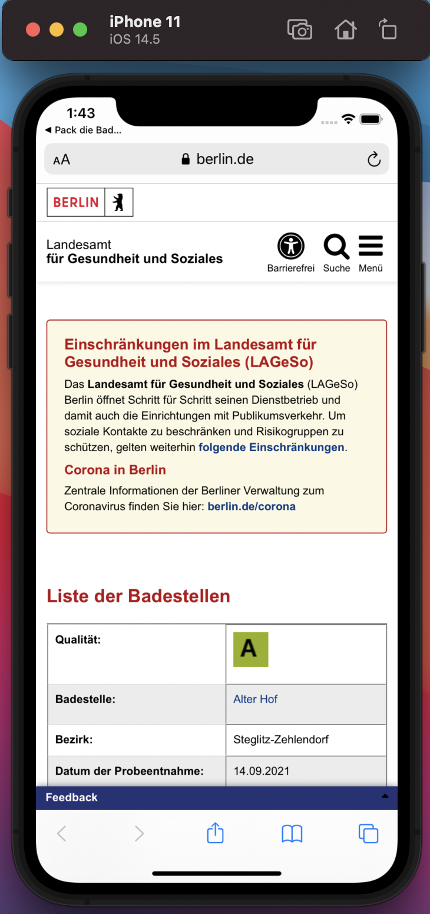

# Application background story
My first mobile iOS Application created with swift. The main purpose is to list all of the registered lake
            in Berlin and shows
            their names, coordinates, and exact location by using google map. The application has the ability to read
            JSON file and convert it
            into data. Here I learned about JSON File format and how to send and receive information to/from it.

# GUI Screenshots

# Usage
Install xCode on Mac OS             
Build and run from xCode            
